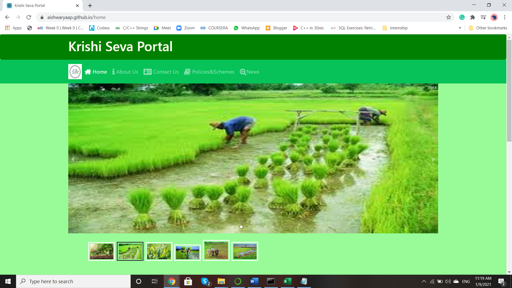

# Atmanirbhar Farm Portal
> Description:  
> A unique user friendly portal for farmers that suggests crops according to the location, profit, soil type, etc. The Farm Portal should help farmers get updates regarding all the agriculture related news and also shows the weather conditions of a particular area to which the farmer gets crop suggestion accordingly.

> Keywords: Crop-recommender, MachineLearning, React, Progressive Web App, API 

## Table of contents
* [Deployed Project](#deployed_project_link)
* [Technologies](#technologies)
* [Features](#features)
* [Status](#status)
* [Contributors](#contributors)

## Deployed_Project_Link:
[https://aishwaryaap.github.io/atmanirbhar_farmportal](https://aishwaryaap.github.io/atmanirbhar_farmportal)

## Technologies
* HTML, CSS, Bootstrap
* Angular JS, React Native, React JS

## Features
#### List of features ready: 
* Crop recommender system
* News
* Weather reports
* Govt. Policies
* User feedback

### Future Scope 
1. Language Translation API for the website.
2. Dataset to bet appended from the user after their individual experience for an efficient algorithm.
3. Customized timeline for each user according to all the crops he/she chooses.
4. Inspirational DIYs for quick urban terrace farming.
5. A local buy and sell Zero-Merchant online Grains/ Vegetables/ Fruits mart for a better income to the local farmers. 

#### To-do list:
* Farming news API
* Google maps API
* Google Translate API
* Dataset to be acquired
* User Crop recommendation
* Reports of suggested systems
* Inspirational DIYs for urban Terrace Farming

## Status
Project is: _in progress_

## Contributors
Aishwarya Phirke
Rutuja Gholap
Tejinderpal Singh
Atharva Patrudkar

## Image

This project was bootstrapped with [Create React App](https://github.com/facebook/create-react-app).

## Available Scripts

In the project directory, you can run:

### `yarn start`

Runs the app in the development mode. 
Open [http://localhost:3000](http://localhost:3000) to view it in the browser.

The page will reload if you make edits. 
You will also see any lint errors in the console.

### `yarn test`

Launches the test runner in the interactive watch mode. 
See the section about [running tests](https://facebook.github.io/create-react-app/docs/running-tests) for more information.

### `yarn build`

Builds the app for production to the `build` folder. 
It correctly bundles React in production mode and optimizes the build for the best performance.

The build is minified and the filenames include the hashes. 
Your app is ready to be deployed!

See the section about [deployment](https://facebook.github.io/create-react-app/docs/deployment) for more information.

### `yarn eject`

**Note: this is a one-way operation. Once you `eject`, you can’t go back!**

If you aren’t satisfied with the build tool and configuration choices, you can `eject` at any time. This command will remove the single build dependency from your project.

Instead, it will copy all the configuration files and the transitive dependencies (webpack, Babel, ESLint, etc) right into your project so you have full control over them. All of the commands except `eject` will still work, but they will point to the copied scripts so you can tweak them. At this point you’re on your own.

You don’t have to ever use `eject`. The curated feature set is suitable for small and middle deployments, and you shouldn’t feel obligated to use this feature. However we understand that this tool wouldn’t be useful if you couldn’t customize it when you are ready for it.

## Learn More

You can learn more in the [Create React App documentation](https://facebook.github.io/create-react-app/docs/getting-started).

To learn React, check out the [React documentation](https://reactjs.org/).

### Code Splitting

This section has moved here: https://facebook.github.io/create-react-app/docs/code-splitting

### Analyzing the Bundle Size

This section has moved here: https://facebook.github.io/create-react-app/docs/analyzing-the-bundle-size

### Making a Progressive Web App

This section has moved here: https://facebook.github.io/create-react-app/docs/making-a-progressive-web-app

### Advanced Configuration

This section has moved here: https://facebook.github.io/create-react-app/docs/advanced-configuration

### Deployment

This section has moved here: https://facebook.github.io/create-react-app/docs/deployment

### `yarn build` fails to minify

This section has moved here: https://facebook.github.io/create-react-app/docs/troubleshooting#npm-run-build-fails-to-minify
